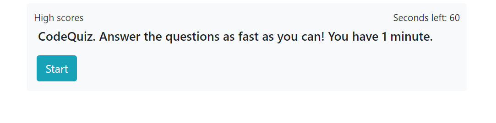
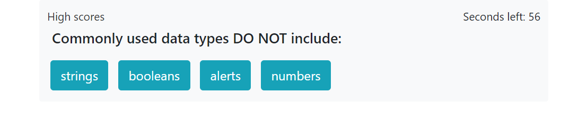
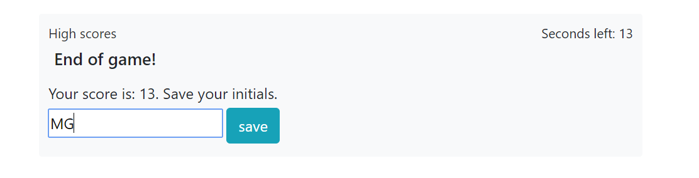
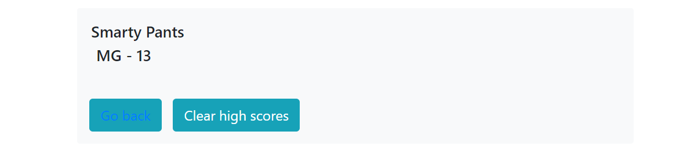

# smartyPants

This is a responsive, short timed quiz about basic coding concepts. Every wrong answer subtracts 5 points from your score. You have one minute to answer and your score comes from the time left when you finished.
At the end, the user is able to save their score.

Deployed site at:

[GitHub](https://tantatinta.github.io/smartyPants/)

